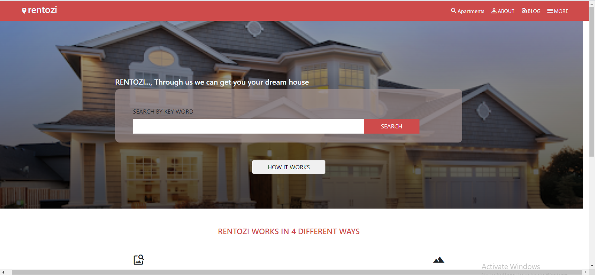

#Rentoz

> This is a CSS and HTML curriculum Microverse Captstone Project. The objective of this project is to create a website using the design provided [here](https://www.behance.net/gallery/25563385/PatashuleKE) with whatever content you desire. I chose to come up with a representation of houses for rent.

## Built With

- HTML,
- CSS,
- Bootstrap
- Flexbox

## Live Demo

[Live Demo Link](https://emmanuelaaron.github.io/rentoz/)

## Getting Started
Clone this repo on your local machine

### Prerequisites
To make this repository working in your local machine you need only a browser.

## Authors

👤 **Emmanuel Isabirye**

- Github: [@EmmanuelAaron](https://github.com/Emmanuelaaron)
- Twitter: [@EmmanuelAaron](https://twitter.com/EmmanuelIsabir1)
- Linkedin: [@EmmanuelAaron](https://www.linkedin.com/in/fullstackwebdev-emma/)

## 🤝 Contributing

Contributions, issues and feature requests are welcome!

Feel free to check the [issues page](https://github.com/Emmanuelaaron/rentoz/issues).

## Show your support

Give a ⭐️ if you like this project!

## Acknowledgments

- Great Thanks to [Julian Blasco](https://github.com/Blasco9)  for the support given during the execution of this project.

- Also Great Thanks to [Mathew Njuguna](https://www.behance.net/mathewnjuguna) for this awesome design.

## 📝 License

This project is [MIT](lic.url) licensed. 
